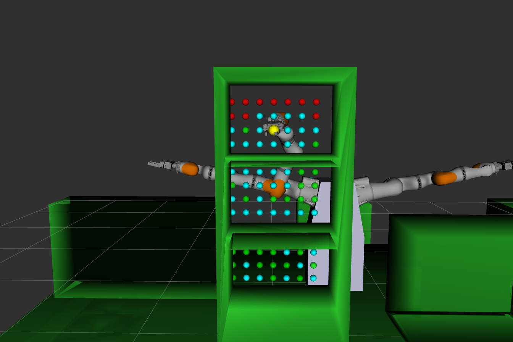
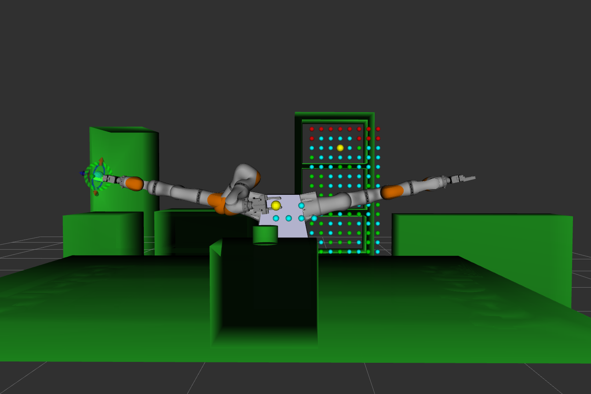

# Valid_trajectory_click.cpp

Questo package contiene due nodi principali per la validazione e visualizzazione delle traiettorie tramite marker e interazione in RViz.

Valid_trajectory_click.cpp -> validate_click.launch.py
Obiettivo:
Pubblicare tutti i marker di destinazione letti dai file YAML (ad esempio Bimby_center_plans.yaml e Rastrelliera_plans.yaml).
I marker rappresentano le pose target dei vari piani.


# Funzionalità interattiva:
Il nodo si iscrive al topic /clicked_point e, quando viene cliccato un punto in RViz, identifica il marker più vicino tra quelli pubblicati.
Una volta trovato il marker (tramite confronto con le pose nel file YAML), il nodo acquisisce la traiettoria associata dal file YAML e la pubblica su display_robot_state, mostrando tutte le configurazioni del robot durante l’esecuzione della traiettoria.

Caso Bimby(Robot da cucina):
Se il piano selezionato prevede anche una fase di pouring (versamento), questa operazione viene gestita e visualizzata, sempre utilizzando i dati memorizzati nel file YAML.

Questo package permette quindi di visualizzare, selezionare e validare interattivamente le traiettorie robotiche, facilitando il debug e la verifica delle sequenze di movimento direttamente in RViz.





## Compilazione

```bash

ros2 launch validate_trajectory validate_click.launch.py

```


## Configurazione RVIZ

Add->By display typp

1. RobotState
2. markerArray


## ExecuteYamlTrajectories.cpp
Questo nodo consente di eseguire movimenti del manipolatore in modalità offline, ovvero dopo aver pianificato le traiettorie nel package robot_skills e averle salvate nei file PickPouringRight.yaml (per il braccio destro) e PickPouringLeft.yaml (per il braccio sinistro).

Il nodo carica la traiettoria desiderata e la esegue tramite l’azione follow_joint_trajectory.

Per coordinare i movimenti dei due bracci e garantire che non si scontrino sopra il robot da cucina, viene utilizzato un esecutore multithread. In questo modo, i movimenti dei bracci sono sincronizzati: quando uno dei due avvia la fase di sollevamento (lift), l’altro si ferma, assicurando la sicurezza durante l’esecuzione delle traiettorie.

# Funzionamento

```bash 
ros2 run validate_trajectory execute_yaml_trajectories_node 


